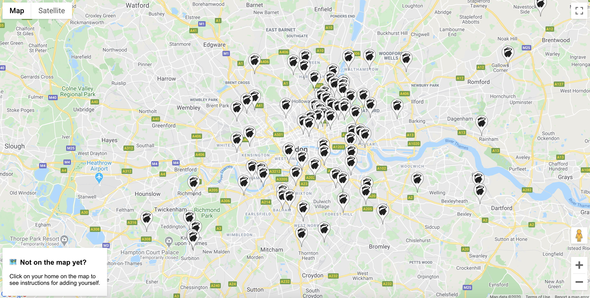

# Badger Map

Where do Badgers live?

[**Here is the map**](https://redbadger.github.io/badger-map)



## Why

Now we're all remote, it could be useful to see who are the nearby badgers to you.

## How

If you wish to participate, you have two options:

- let me know your postcode on slack (@charypar)
- Add yourself into [this spreadsheet](https://docs.google.com/spreadsheets/d/1U_mjJv-3xlxfx1R1-f6eJY5UjWbDEVevu_oCziy4a4I/edit)

You can rightclick any position on the map to figure out your latitude/longitude.

## Running locally

First, you'll need to get a `.env` file from one of the developers. The file
contains API keys that allow running the map locally. If you're [setting up your
own map](#id-like-my-own-map-please), you'll need to create a set of keys which
allow localhost as a referrer.

Then you should be able to run the map locally with

```sh
$ ./run-local.sh
Server listening on port 8000
```

Now you can open <http://localhost:8000> and everything should work.

## I'd like my own map please

This is a little more complicated than I'd like, but it's doable with a little
effort. There are a couple pre-requisites:

1. Your organisation uses Google's G-Suite
2. You can create a project in your organisation's developer console and attach
   a billing account (sadly, the necessary Google APIs are not free of charge).

Start by forking the repository on GitHub and do everything below with your fork.

### The overall architecture

...if it can be called that. The map is a completely static web page. Everything
dynamic happens in the browser. It is deployed using [Github pages](https://pages.github.com/)
because it's the easiest way with no additional tooling.

The data is coming from a google spreadsheet shared with everyone in the
organisation. The sharing preferences double as authorization for access to
people's location information, so that only members of the organisation can
see where people live.

The page uses the following Google services:

- [Maps JS API](https://developers.google.com/maps/documentation/javascript/tutorial)
  to... well, draw the map
- [Spreadsheets API](https://developers.google.com/sheets/api)
  to load data from the spreadsheet
- [Authentication](https://developers.google.com/identity/sign-in/web/reference),
  in order to access the spreadsheet API on behalf of the person looking at the page

The JavaScript code on the page first start an authentication flow and when
successful, fetches the data from the spreadsheet, as a collection of rows and
creates markers on the map.

### Set up the spreadsheet

The spreadsheet needs to have four columns:

```txt
Name, Latitude, Longitude, Slack handle
```

Next, mark the range where the data will go, and in the menu under "Data" select
Named Ranges, add one and name it "People" (this is what the code assumes).

Set the sharing settings to "anyone within organisation can find and edit"

Copy the ID of the spreadsheet from the URL. The URL will look something like this:
`https://docs.google.com/spreadsheets/d/1U_mjJv-3xlxgx1R1-f6eJY5UjWbDEVevu_oCziy4a4I/edit#gid=0`
the ID is the `1U_mjJv-3xlxgx1R1-f6eJY5UjWbDEVevu_oCziy4a4I` part. Note it down.

### Create the google project and get API key

This is the trickiest part of the set up. You may want to make a cup of tea.

First, open the [Google Developers Console](https://console.developers.google.com/).

You'll need to create a new project: At the top right, open the project picker
and choose "New Project", name your project and for all further steps, make
sure the project is selected.

Next, from the hamburger menu, select "Billing". You'll either need to create
a billing account, or have management access to one that exists. Choose the
right organisation from the drop-down and switch to the "my projects" tab. Find
the project you just created and click the kebab menu (the three dots on the
very right) and select change billing. Pick the right billing account and confirm
with "Set Account". You can now use paid APIs.

Now we need to enable the right APIs to be used. In the hamburger menu, under
"APIs & Services", click "Library". Search for and add the following:

- Google Sheets API
- Maps JavaScript API

You will need to go into each APIs page and click "Enable".

Finally, we need to generate a set of credentials to allow access. Once again in
the hamburger menu, pick "Api & Services" and "Credentials". At the top of the
screen, click "Create Credentials" and select "API key". Note down the key, you'll
need it later on. You should also restrict the key immediately. Use the "HTTP
Referrers" restriction and put in the URL of your site (e.g. `http://my-page.github.io`)
and `http://localhost:8000`). Additionally, restrict the key to access the two
APIs we just enabled (just in case you later add more).

Get back to the credentials screen and create another credential, this time
an OAuth Client ID. This will let us do things on behalf of the users. Pick "Web
Application" and put the same two URLs as above as "Authorised JavaScript origins".
Note down the Client ID at the top right.

### Configure Github Pages and Secrets for Github Actions

The map is set up to deploy to Github Pages. As a deployment source, we'll use
`gh-pages` branch. Make sure you have one. In your repository settings, enable
Github Pages and choose `gh-pages` as a source.

In order to avoid our API tokens to be accidentally used by forks of the repo,
the map is deployed to the `gh-pages` branch via a Github Actions pipeline, which
injects the necessary configuration. A nice side-effect is you don't need to
change the code at all.

In your repository settings, find the secrets section and create four secrets:

- `ACCESS_TOKEN` with your [Personal Access Token](https://help.github.com/en/github/authenticating-to-github/creating-a-personal-access-token-for-the-command-line) which has access to the repo
- `API_KEY` with the Google API key from earlier
- `CLIENT_ID` the Google OAuth Client ID from earlier
- `SPREADSHEET_ID` the ID of your spreadsheet from earlier

You'll need to push a change to the master branch. You can slightly edit the
readme, for example. You should see the Github Action run and the `gh-pages`
branch should update, which should deploy the map to github pages, i.e.
`https://{yourname}.github.io/{your-fork-name}/`.
